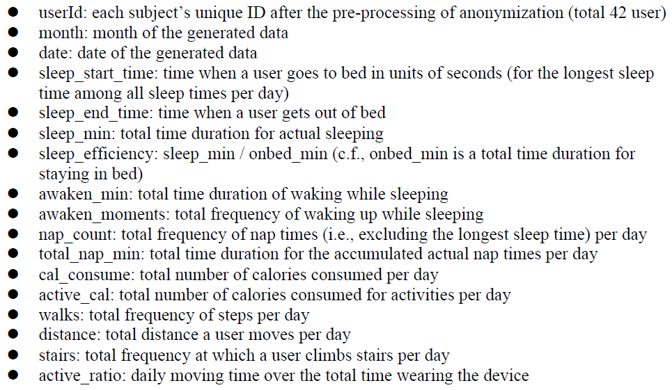
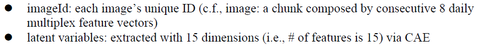
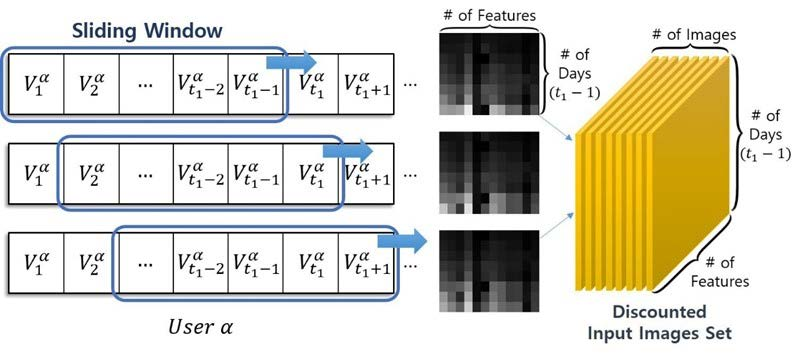
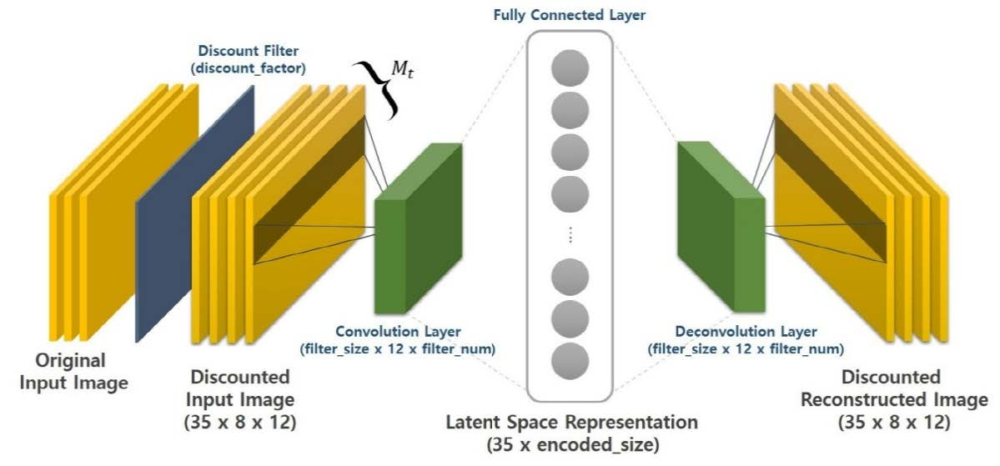
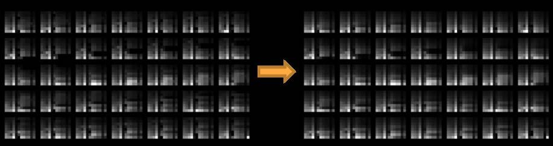

# Clustering Insomnia Patterns by Data From Wearable Devices: Algorithm Development and Validation Study
Implementation details including codes in Tensorflow and datasets from wearable devices, Fitbit Charge 2.


### Data
You can find two datasets in the sub-directory named "data". One is for providing the raw data retrieved from the Fitbit Charge 2 device ("Data.csv"). Each row represents daily abstraced values of features for each subject. There are total of 42 subjects; all subjects are anonymized and userIds are randomly assigned for each subject. The features included in the dataset are as follows. One remark is that for the rows related to the naps, the sleep-related daily abstract features were assigned as "-1", since those features are calculted soley for the main sleep per day.



Another one is for providing the latent variables extracted via Covolutional Autoencoder (CAE). The latent variables were the result of minimizing L2-norm regularized reconstruction loss (L) between the original image (𝑦) and the reconstructed image (𝑦^) for 1,470 images (𝑛 = 1470) on the CAE. The features included in the dataset are as follows.




### Required packages
The code has been tested running under Python 3.6.6. with the following packages installed (along with their dependencies):

- numpy == 1.16.0
- pandas == 0.23.4
- tensorflow == 1.12.0
- scikit-learn == 0.20.2


### Code
We provide codes from Step 1 to Step 3 on the “Clustering Steps” section at the manuscript. Based on the codes, it is possible to imagify the given original data then to extract latent variables via CAE. For the remaining Step 4 and Step 5, we have not included the
corresponding codes since we also use the open sources of t-SNE and various conventional clustering methods.

##### How to Run
```
1. Setting the path of the model codes in main.ipynb.
   (i.e., Two model codes "layers.py" and "model.py", constructing the intenal layers of the CAE model and composing the structure of the CAE, respectively, can be set 
   
   your parameter.json is located in 'user/Documents/data/parameter.json',you should set it as json_path in 
    main.py)
2. python main.py -- After you finish step 1,2 , you can execute main.py and get imputed data.                
``` 

#### Step 1: Preprocessing of Time-Series Data & Step 2: Composing Sequential Images From Data
By runnung the code, we can convert the consecutive daily data into a image; one image is composed of the 8 consecutive daily vectors with 96 dimensions (8 days x 12 featuers). The imagifying process follows the below figure.



#### Step 3: Learning Representations With Reducing Dimensions via Convolutional Autoencoder
By runnning the code, it is possible to extract the latent variables of the CAE as presented at the dataset "Saved_latent.csv." The interal structure of th CAE is as follows.



##### Example Result
By running the main.ipynb, 


